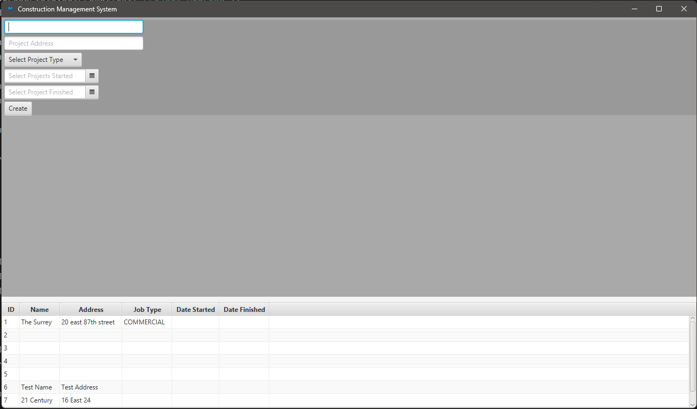

# Construction Manager Application

A desktop application built with **JavaFX** for managing construction projects, change orders, and project data.

This project is part of my journey learning **Java, Spring Boot, and software architecture**, where I am building a real-world construction management system from scratch.

---

## Technologies Used

- Java
- JavaFX
- Spring Boot
- Spring Data JPA
- Maven
- MySQL

---

## Current Features

- Create Project Template UI
- Project TableView
- Service layer for project creation
- Database persistence with JPA
- Basic UI layout using JavaFX controls

---

## Application Preview

### Create Project Template



---

## Project Structure

```
src
 ├── controller
 ├── service
 ├── repository
 ├── model
 └── ui
```

The application follows a layered architecture:

```
UI → Controller → Service → Repository → Database
```

---

## Current Development Stage

This project is currently under active development.  
The goal is to build a **complete construction management system** capable of managing:

- Projects
- Change Orders
- Employees
- Attendance
- Financial tracking

---

## Future Features

Planned improvements include:

- Project editing and deletion
- Change order management
- Employee management
- Requistion management
- Dashboard view
- Reporting tools
- Improved UI/UX

---

## Author

Ivan Maior  

Email: ivanmaior33@gmail.com  

---

## Status

🚧 Work in progress
